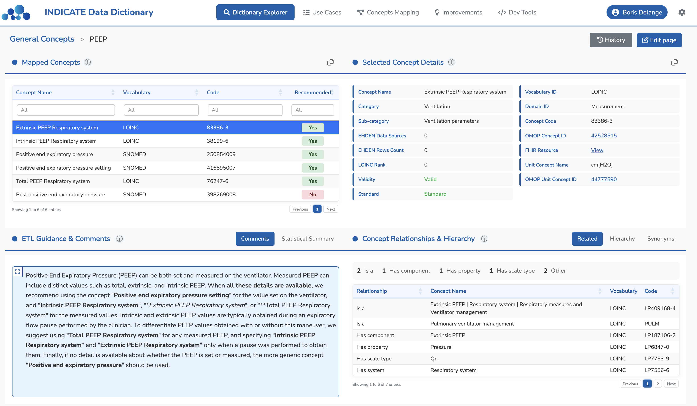
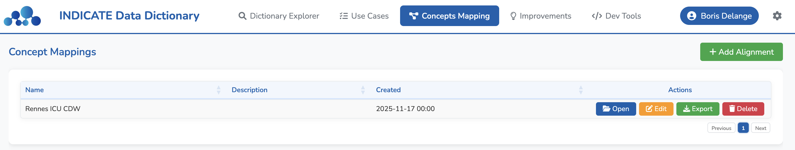
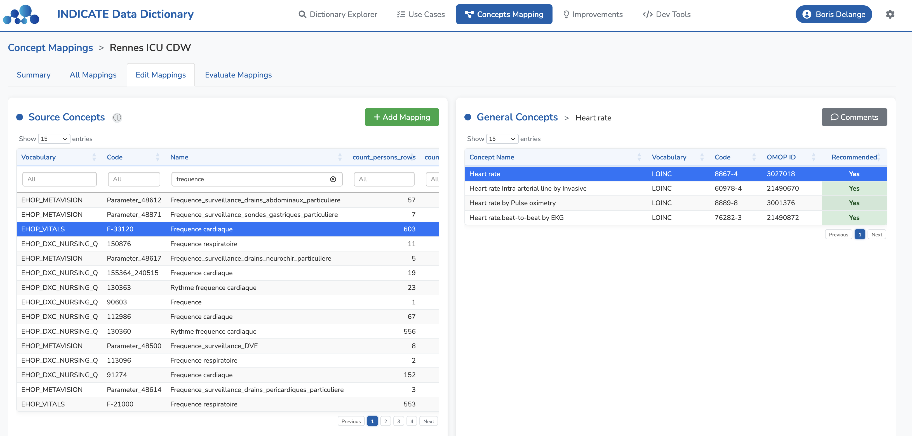
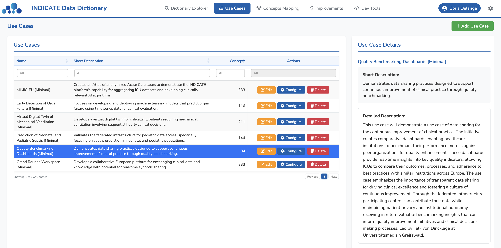
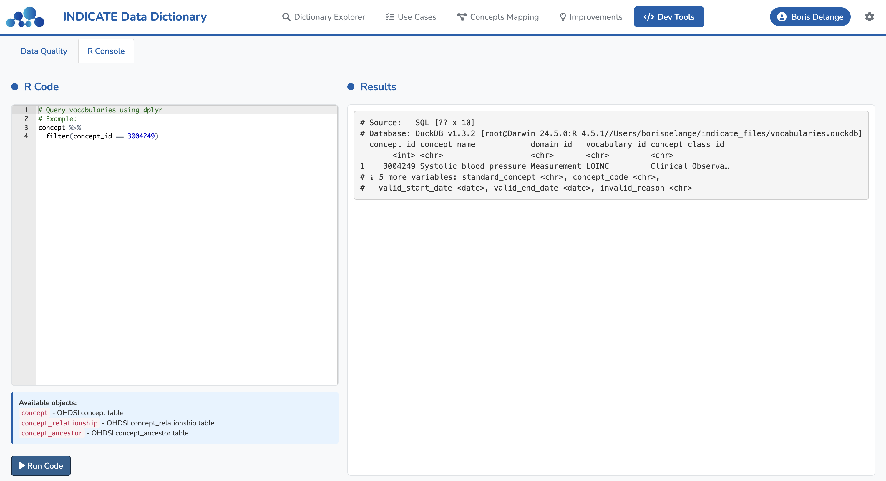

# INDICATE Minimal Data Dictionary


## Table of Contents

- [Overview](#overview)
- [Context](#context)
  - [The INDICATE Project](#the-indicate-project)
  - [The Minimal Data Dictionary](#the-minimal-data-dictionary)
  - [Standard Terminologies](#standard-terminologies)
  - [Clinical Use Cases](#clinical-use-cases)
- [Installation](#installation)
- [Usage](#usage)
  - [Running the Application](#running-the-application)
  - [First Connection](#first-connection)
    - [Login](#login)
    - [Setting up ATHENA vocabularies](#setting-up-athena-vocabularies)
  - [Usage Guide](#usage-guide)
    - [1. Dictionary Explorer](#1-dictionary-explorer)
    - [2. Concept Mapping](#2-concept-mapping)
    - [3. Projects Management](#3-projects-management)
    - [4. Settings](#4-settings)
    - [5. Development Tools](#5-development-tools)
- [Governance and Versioning](#governance-and-versioning)
- [Alignment with European Health Data Space (EHDS)](#alignment-with-european-health-data-space-ehds)
- [License](#license)
- [Acknowledgments](#acknowledgments)
- [Contact](#contact)
- [Contributing](#contributing)

## Overview

The `indicate` R package provides an interactive Shiny application to explore the **INDICATE Minimal Data Dictionary**, a consensus-based collection of standardized clinical concepts designed to harmonize intensive care unit (ICU) data across Europe. The dictionary addresses semantic interoperability challenges in federated healthcare data infrastructures by providing explicit recommendations for terminology selection across diverse European ICU settings.

## Context

### The INDICATE Project

The INDICATE project, launched in December 2024 and funded by the European Union's Digital Europe Programme (grant 101167778), aims to establish a secure federated infrastructure for standardized ICU data across Europe. The project addresses critical challenges in collaborative research, AI model development, and data sharing for clinical decision-making and quality improvement.

### The Minimal Data Dictionary

The INDICATE Minimal Data Dictionary comprises **332 general concepts** linked to **23,241 standard concepts** from international terminologies, organized into nine categories:

| Category | Description | General Concepts | Standard Concepts |
|----------|-------------|------------------|-------------------|
| Clinical Observations | Non-numeric clinical assessments (e.g., Glasgow Coma Scale) | 15 | 16 |
| Conditions | Diagnoses and medical conditions (e.g., ARDS, sepsis) | 17 | 315 |
| Demographics, Encounters & Other | Patient demographics, admissions and other data (e.g., age, gender, dates) | 20 | 51 |
| Drugs | Medications with dose and form (e.g., Norepinephrine 2 MG/ML Injection) | 112 | 9,153 |
| Labs | Blood and urine tests (e.g., lactate, creatinine, sodium) | 76 | 265 |
| Microbiology | Culture results and pathogens (e.g., Pseudomonas aeruginosa) | 48 | 12,628 |
| Procedures | Medical interventions (e.g., intubation, dialysis, ECMO) | 8 | 344 |
| Ventilation | Mechanical ventilation parameters (e.g., FiO₂, PEEP) | 26 | 207 |
| Vitals | Basic physiological measurements (e.g., heart rate) | 10 | 262 |

### Standard Terminologies

The dictionary uses internationally recognized standard terminologies:
- **SNOMED CT** for clinical concepts and ventilation parameters
- **LOINC** for laboratory measurements
- **RxNorm** for medications (Clinical Drug level)
- **ICD-10** for diagnoses
- **UCUM** for units of measure

### Clinical Use Cases

The dictionary was developed to support six clinical use cases:
1. **MIMIC-EU** - An Atlas of Anonymized Acute Care Cases
2. **Early Detection of Organ Failure**
3. **Virtual Digital Twin**
4. **Neonatal and Pediatric Sepsis Prediction**
5. **Quality Benchmarking Dashboards**
6. **Grand Rounds Workspace**

## Installation

```r
# Install the indicate package from GitLab
devtools::install_git("https://gitlab.com/ricdc/outils/indicate-data-dictionary.git")
```

## Usage

### Running the Application

To launch the INDICATE application:

```r
indicate::run_app()
```

The application will open in your default web browser.

### First Connection

#### Login

When you first launch the application, you will see the login screen.

<p align="center">
  
</p>

**Default credentials**:
- **Username**: `admin`
- **Password**: `admin`

**Important**: For security reasons, you should change the default password immediately after your first login:
1. Click the **Settings icon** (cog) in the top-right corner
2. Navigate to **Users**
3. Update the admin password

**Anonymous access**:
- You can also log in as **Anonymous** for read-only access
- Anonymous users can browse the dictionary but cannot make modifications
- No editing, creating, or deleting of concepts is allowed in anonymous mode

#### Setting up ATHENA vocabularies

After logging in, you need to import ATHENA vocabulary data to enable full functionality.

**Step 1: Download vocabularies from ATHENA**

1. Go to [https://athena.ohdsi.org](https://athena.ohdsi.org)
2. Select the following vocabularies:
   - **LOINC**
   - **SNOMED**
   - **RxNorm**
   - **RxNorm Extension**
   - **ATC**
   - **ICD10**
3. Click **Download Vocabularies**
4. Extract the downloaded ZIP file to a folder on your computer


**Step 2: Import vocabularies into the application**

1. Click the **Settings icon** (cog) in the top-right corner
2. Navigate to **General Settings**
3. In the **OHDSI Vocabularies** section, click **Browse**
4. Select the folder containing the extracted CSV files from ATHENA
5. The application will create a DuckDB database from the CSV files
   - This database will be saved in the `app_folder` directory (specified with the `app_folder` argument of `run_app()`, or your home directory by default)
   - Future connections will load concepts faster from this database
6. Wait for the import to complete
   - The application will process all CSV files
   - A progress indicator shows the import status
   - Once complete, all features will be available


### Usage Guide

#### 1. Dictionary Explorer

The Dictionary Explorer allows you to browse the INDICATE Minimal Data Dictionary. General concepts are high-level clinical concepts used in study definitions, such as "Heart rate" or "Type 2 diabetes", without detailed coding information.

**Browsing General Concepts**:

The main view displays a single table listing all general concepts organized by category and subcategory. Use column filters to search for specific concepts (e.g., "lactate", "sepsis"). Double-click any row to view detailed information.


**Viewing General Concept Details**:

After selecting a general concept, a four-panel layout displays detailed information:
- **Top-left**: General concept information (category, subcategory, name)
- **Bottom-left**: All terminology mappings to standard vocabularies (SNOMED, LOINC, RxNorm, ICD-10)
- **Top-right**: Selected mapping details with links to ATHENA and FHIR resources
- **Bottom-right**: Expert comments and ETL guidance

The "Standard" column indicates standard OMOP concepts (S) vs non-standard or classification concepts. Click on a mapping to see full details in the right panels.



**Exploring Concept Relationships**:

View the hierarchical structure of concepts with the relationships tree. See parent and child concepts in the hierarchy and understand relationship types (Is a, Has ingredient, Subsumes, etc.).

<p align="center">
  
</p>

**Using External Links**:
- **OMOP Concept ID**: Click to open ATHENA vocabulary browser
- **FHIR Resource**: Click to open FHIR Terminology Server
- These facilitate ETL processes and data transformation

#### 2. Concept Mapping

The Concept Mapping module allows you to align your custom concepts with the INDICATE dictionary.

**Managing Alignments**:
1. Navigate to the **Concepts Mapping** tab
2. View the list of all alignments in the data table
3. Each alignment represents a project or institution's set of concepts (e.g., "CHU Rennes alignment")
4. Browse and search through your existing alignments



**Creating a New Alignment**:
1. Click the **Add Alignment** button to create a new alignment project
2. Import a CSV file containing the list of concepts you want to align to the INDICATE Data Dictionary
3. The CSV should include your custom concept names and any relevant metadata
4. This creates an alignment containing all concepts from your institution or project


**Mapping Individual Concepts**:

Once your alignment is created, you can map each concept individually:

1. **Left panel**: Select the general concept from the INDICATE dictionary that matches your custom concept
2. **Right panel**: Choose specific OMOP mappings for this concept (you can select multiple)
   - Use "Add descendants" to automatically include child concepts
   - Search ATHENA vocabulary for additional concepts
3. Review and save the mapping for this concept



#### 3. Projects Management

Define and manage projects with assigned concepts.



**Defining Projects**:
1. Navigate to the **Projects** tab
2. Click **Add Project** to create a new project
3. Enter name, description, and short name
4. Save the project

**Assigning Concepts**:
1. Select a project from the list
2. View assigned concepts in the table
3. Add or remove concept assignments as needed
4. Mark concepts as required or optional

#### 4. Settings

**Backup & Restore**:
1. Navigate to the **Settings** tab > **Backup & Restore**
2. Click **Download backup (ZIP)** to save your application data (database, concept mappings, alignments)
3. To restore, upload a previously downloaded backup ZIP file
4. After restore, click **Reload application** to apply changes

**OHDSI Vocabularies**:
1. Navigate to the **Settings** tab > **OHDSI Vocabularies**
2. Browse and select your OHDSI vocabulary folder (or upload CSV files in container mode)
3. The application will create a DuckDB database for fast concept lookups

#### 5. Development Tools



## Governance and Versioning

The INDICATE consortium has established a governance framework allowing members to propose modifications. All changes are tracked in version-controlled repositories to ensure:
- Transparency in dictionary evolution
- Accommodation of diverse requirements
- Preservation of semantic harmonization across the network

## Alignment with European Health Data Space (EHDS)

Future development includes alignment with **HealthDCAT-AP**, the European metadata profile for describing health data assets under the EHDS framework. This will:
- Make the dictionary easier to find, reference, and reuse
- Strengthen its role in enabling semantic interoperability
- Facilitate connections to federated infrastructures
- Ensure metadata consistency with FAIR principles

## License

This project is licensed under the **GNU General Public License v3.0 (GPLv3)** - see the [LICENSE](LICENSE) file for details.

## Acknowledgments

This work is funded by the European Union's Digital Europe Programme under grant 101167778.

The INDICATE consortium comprises partners from 12 European countries, with 15 data providers implementing a pan-European federated infrastructure.

## Contact

For questions or feedback about this package:

**Boris Delange**
Email: boris.delange@univ-rennes.fr

For information about the INDICATE project:
Visit: [INDICATE Project Website](https://indicate-europe.eu/)

## Contributing

Contributions to improve the package are welcome. Please contact the author for collaboration opportunities.

## Deployment on Hugging Face Spaces

The application can be deployed on [Hugging Face Spaces](https://huggingface.co/spaces) using Docker.

### Quick Start

1. Create a new Space at [huggingface.co/new-space](https://huggingface.co/new-space) with **Docker** SDK
2. Clone the Space repository and copy all application files
3. Ensure the README.md has the YAML header:
   ```yaml
   ---
   title: INDICATE Data Dictionary
   sdk: docker
   ---
   ```
4. Push to deploy

### Configuration

See the [Spaces configuration reference](https://huggingface.co/docs/hub/spaces-config-reference) for README header options.

**Important notes**:
- The application listens on port **7860** (Hugging Face default)
- First build takes ~15-20 minutes (R package compilation)
- Use Git LFS for binary files (images): `git lfs track "*.png"`

### Data Persistence

**Warning**: Hugging Face Spaces are ephemeral. When the Space is redeployed or restarted, all local files (database, alignments, uploaded vocabularies) are lost.

**Before redeploying**:
1. Go to **Settings** > **Backup & Restore**
2. Click **Download backup (ZIP)** to save your data locally

**After redeploying**:
1. Go to **Settings** > **Backup & Restore**
2. Upload your backup ZIP file to restore your data
3. Go to **Settings** > **OHDSI Vocabularies** to re-upload vocabulary files if needed
