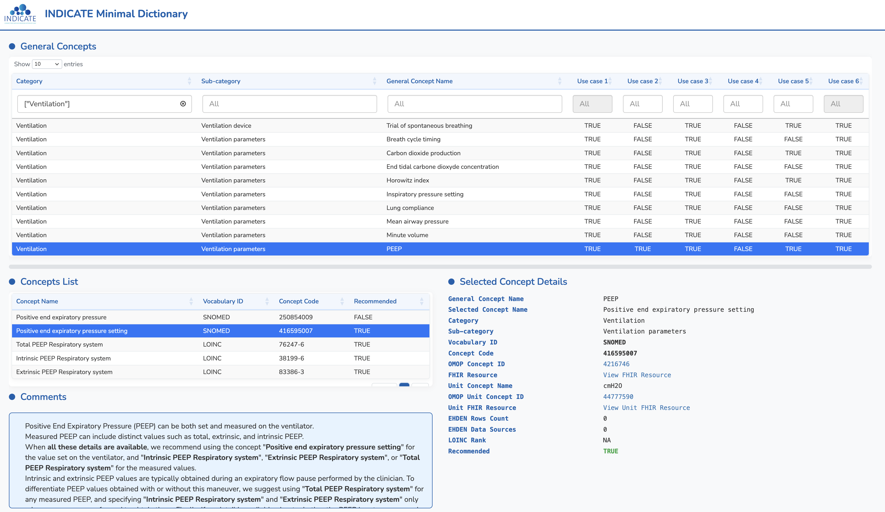
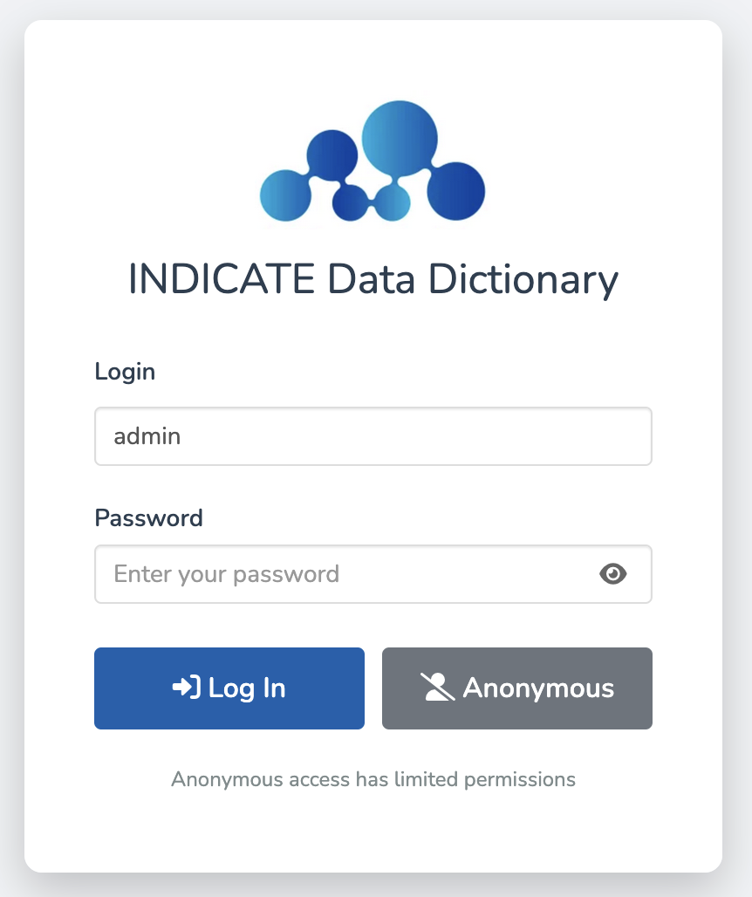
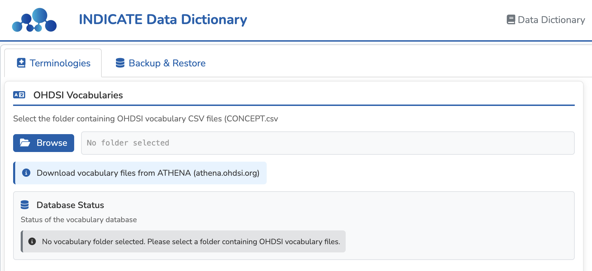
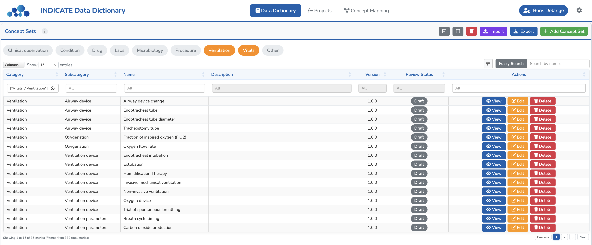
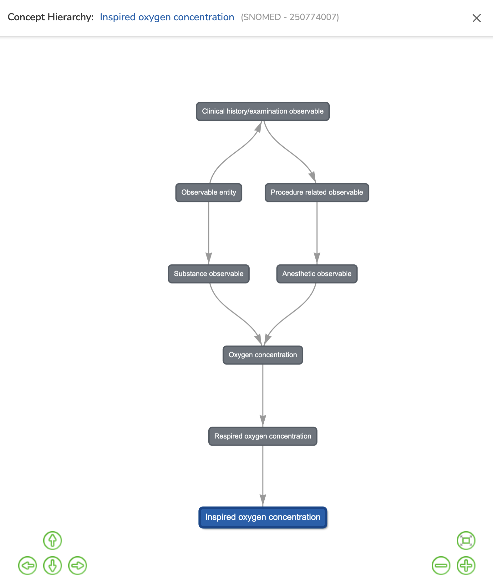

# INDICATE Minimal Data Dictionary

[](https://joinup.ec.europa.eu/collection/eupl/eupl-text-eupl-12)
[](https://cran.r-project.org/)
[](https://indicate-europe.eu/)



## Table of Contents

- [Overview](#overview)
- [Context](#context)
  - [The INDICATE Project](#the-indicate-project)
  - [The Minimal Data Dictionary](#the-minimal-data-dictionary)
  - [Standard Terminologies](#standard-terminologies)
  - [Clinical Use Cases](#clinical-use-cases)
- [Features](#features)
- [Installation](#installation)
- [Usage](#usage)
  - [Running the Application](#running-the-application)
  - [First Connection](#first-connection)
  - [Usage Guide](#usage-guide)
- [Deployment](#deployment)
- [Governance and Versioning](#governance-and-versioning)
- [Alignment with European Health Data Space (EHDS)](#alignment-with-european-health-data-space-ehds)
- [License](#license)
- [Acknowledgments](#acknowledgments)
- [Contact](#contact)
- [Contributing](#contributing)

## Overview

The `indicate` R package provides an interactive Shiny application to explore the **INDICATE Minimal Data Dictionary**, a consensus-based collection of standardized clinical concepts designed to harmonize intensive care unit (ICU) data across Europe. The dictionary addresses semantic interoperability challenges in federated healthcare data infrastructures by providing explicit recommendations for terminology selection across diverse European ICU settings.

Built on the **OHDSI Concept Set Specification** (extended with lifecycle metadata), the application enables clinical experts and data engineers to browse, review, and manage concept sets aligned with the OMOP Common Data Model.

## Context

### The INDICATE Project

The [INDICATE project](https://indicate-europe.eu/), launched in December 2024 and funded by the European Union's Digital Europe Programme (grant 101167778), aims to establish a secure federated infrastructure for standardized ICU data across Europe. The consortium comprises partners from **12 European countries**, with **15 data providers** implementing a pan-European federated infrastructure for collaborative research, AI model development, and data sharing.

### The Minimal Data Dictionary

The INDICATE Minimal Data Dictionary comprises **332 concept sets** organized into nine categories:

| Category | Concept Sets | Description |
|----------|:------------:|-------------|
| Demographics and Encounters | 14 | Patient demographics and admissions (e.g., age, gender, dates) |
| Conditions | 17 | Diagnoses and medical conditions (e.g., ARDS, sepsis) |
| Clinical Observations | 21 | Non-numeric clinical assessments (e.g., Glasgow Coma Scale) |
| Vital Signs | 10 | Basic physiological measurements (e.g., heart rate) |
| Laboratory Measurements | 76 | Results from biological samples (e.g., lactate, creatinine, sodium) |
| Microbiology | 48 | Culture results and pathogens (e.g., Pseudomonas aeruginosa) |
| Ventilation | 26 | Mechanical ventilation parameters (e.g., FiO2, PEEP) |
| Drugs | 112 | Medications (dose and form) (e.g., Norepinephrine 2 MG/ML Injection) |
| Procedures | 8 | Medical interventions (e.g., intubation, dialysis, ECMO) |

All concept sets and project definitions are versioned on GitHub: [indicate-eu/data-dictionary-content](https://github.com/indicate-eu/data-dictionary-content/).

### Standard Terminologies

The dictionary uses internationally recognized standard terminologies mapped to the OMOP Common Data Model:
- **SNOMED CT** for clinical concepts and ventilation parameters
- **LOINC** for laboratory measurements
- **RxNorm** for medications (Clinical Drug level)
- **UCUM** for units of measure

### Clinical Use Cases

The dictionary was developed to support six clinical use cases:
1. **MIMIC-EU** - An Atlas of Anonymized Acute Care Cases
2. **Early Detection of Organ Failure**
3. **Virtual Digital Twin**
4. **Neonatal and Pediatric Sepsis Prediction**
5. **Quality Benchmarking Dashboards**
6. **Grand Rounds Workspace**

## Features

- **Dictionary Explorer** - Browse, search, and filter 332 concept sets across 9 clinical categories
- **Concept Detail View** - Four-panel layout with concept metadata, standard mappings, ATHENA/FHIR links, and expert comments
- **Concept Relationships** - Interactive hierarchy visualization (parent/child relationships, concept graph)
- **Review Workflow** - Structured review process with status tracking (draft, pending review, approved, needs revision, deprecated)
- **Version History** - Changelog tracking for all concept set modifications
- **Projects Management** - Define clinical projects and assign relevant concept sets
- **JSON Import/Export** - OHDSI-compliant JSON format with INDICATE metadata extensions
- **GitHub Integration** - Import concept sets from GitHub repositories with automatic update detection
- **Multilingual Support** - English and French translations
- **User Management** - Role-based access control (Admin, Editor, Read-only)
- **OHDSI Vocabulary Integration** - DuckDB-powered ATHENA vocabulary browser with Parquet/CSV support
- **Concept Mapping** - Align local concepts to the INDICATE dictionary *(in development)*

## Installation

```r
# Install devtools if you don't have it
install.packages("devtools")

# Install the indicate package
devtools::install_github("indicate-eu/data-dictionary")
```

### Prerequisites

- R >= 4.0.0
- The following system libraries may be required depending on your OS:
  - `libsodium-dev` (for bcrypt)
  - `libxml2-dev` (for XML parsing)
  - `libcurl4-openssl-dev` (for HTTP requests)

## Usage

### Running the Application

```r
indicate::run_app()
```

The application will open in your default web browser.

Optional arguments:
```r
indicate::run_app(
  app_folder = "~/my_indicate_data",  # Custom data directory (default: ~/indicate_files)
  port = 3838                          # Custom port
)
```

### First Connection

#### Login

When you first launch the application, you will see the login screen.

<p align="center">
  
</p>

**Default credentials**:
- **Username**: `admin`
- **Password**: `admin`

**Important**: Change the default password immediately after your first login via **Users** in the settings.

#### Importing Concept Sets

On first connection, the dictionary is empty. The application will prompt you to download the concept sets from the [indicate-eu/data-dictionary-content](https://github.com/indicate-eu/data-dictionary-content/) GitHub repository. Click **Download** to import all concept sets and project definitions automatically.

<!-- Screenshot placeholder: first connection import prompt -->
<!--  -->

#### Setting up ATHENA Vocabularies

After logging in, you need to import ATHENA vocabulary data to enable full functionality (concept lookups, relationships, hierarchy navigation).

**Step 1: Download vocabularies from ATHENA**

1. Go to [https://athena.ohdsi.org](https://athena.ohdsi.org)
2. Select the following vocabularies: **LOINC**, **SNOMED**, **RxNorm**, **RxNorm Extension**, **ATC**, **ICD10**
3. Click **Download Vocabularies**
4. Extract the downloaded ZIP file to a folder on your computer


**Step 2: Import vocabularies into the application**

1. Click the **Settings icon** (cog) in the top-right corner
2. Navigate to **General Settings**
3. In the **OHDSI Vocabularies** section, click **Browse** and select the folder containing the extracted CSV/Parquet files
4. The application will create a DuckDB database for fast concept lookups
5. Wait for the import to complete (a progress indicator shows the status)

<p align="center">
  
</p>

### Usage Guide

#### 1. Dictionary Explorer

The Dictionary Explorer is the main view for browsing the INDICATE Minimal Data Dictionary. Concept sets are high-level clinical concepts used in study definitions, such as "Heart rate" or "Tidal volume".

**Browsing Concept Sets**:

The main view displays all concept sets organized by category and subcategory. Use column filters to search for specific concepts. Double-click any row to view detailed information.



**Viewing Concept Set Details**:

After selecting a concept set, a detail page opens with four tabs: **Concepts**, **Comments**, **Statistics**, and **Review**.

The **Concepts** tab uses a three-panel layout:
- **Left**: list of concepts in the concept set
- **Top-right**: details of the selected concept (ATHENA and FHIR links)
- **Bottom-right**: related concepts, hierarchy, and synonyms

The other tabs provide expert comments and ETL guidance (Comments), distribution charts and summary statistics (Statistics), and review workflow with status tracking (Review).


**Exploring Concept Relationships**:

View the hierarchical structure of concepts with the interactive relationships graph. See parent and child concepts in the hierarchy and understand relationship types (Is a, Has ingredient, Subsumes, etc.).

<p align="center">
  
</p>

**Using External Links**:
- **OMOP Concept ID**: Click to open the ATHENA vocabulary browser
- **FHIR Resource**: Click to open the FHIR Terminology Server

#### 2. Concept Mapping

> **Note**: This module is currently in development.

The Concept Mapping module will allow you to align your local institution's concepts with the INDICATE dictionary through an interactive mapping workflow.

<!-- Screenshot placeholder: concept mapping interface -->
<!--  -->

#### 3. Projects Management

Define clinical projects and assign relevant concept sets from the dictionary.


**Managing Projects**:
1. Navigate to the **Projects** tab
2. Click **Add Project** to create a new project with name, description, short name, justification, and bibliography
3. Assign concept sets to the project
4. Import projects from a GitHub repository

<!-- Screenshot placeholder: project detail view -->
<!--  -->

#### 4. Settings

**General Settings**:
- Configure OHDSI vocabulary folder (CSV or Parquet)
- Backup and restore application data (ZIP export/import)

**Dictionary Settings**:
- Configure recommended units and unit conversions
- Manage ETL guidelines (markdown instructions for concept mapping)

**User Management**:
- Create and manage user accounts
- Assign access levels (Admin, Editor, Read-only)
- User profiles with profession, affiliation, and ORCID

## Deployment

### Docker

The application includes a Dockerfile for containerized deployment:

```bash
docker build -t indicate .
docker run -p 3838:3838 indicate
```

## Governance and Versioning

The INDICATE consortium has established a governance framework allowing members to propose modifications through the built-in review workflow. All changes are tracked via:
- **Version history** with semantic versioning per concept set
- **Changelog** recording who changed what and when
- **Review status** tracking (draft, pending review, approved, needs revision, deprecated)
- **JSON export** for version-controlled repositories

## Alignment with European Health Data Space (EHDS)

Future development includes alignment with **HealthDCAT-AP**, the European metadata profile for describing health data assets under the EHDS framework. This will:
- Make the dictionary easier to find, reference, and reuse
- Strengthen its role in enabling semantic interoperability
- Facilitate connections to federated infrastructures
- Ensure metadata consistency with FAIR principles

## License

This project is licensed under the **European Union Public Licence v1.2 (EUPL-1.2)** - see the [LICENSE](LICENSE) file for details.

## Acknowledgments

This work is funded by the **European Union's Digital Europe Programme** under grant **101167778**.

The INDICATE consortium comprises partners from 12 European countries, with 15 data providers implementing a pan-European federated infrastructure for intensive care research.

## Contact

**Boris Delange**
Email: boris.delange@univ-rennes.fr

For information about the INDICATE project: [https://indicate-europe.eu/](https://indicate-europe.eu/)

## Contributing

Contributions are welcome. Please open an issue or contact the author for collaboration opportunities.
