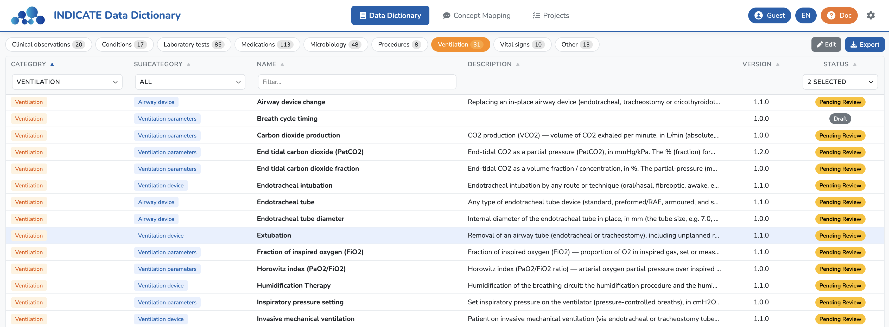

# INDICATE Data Dictionary Content

[](https://indicate-eu.github.io/data-dictionary-content/)
[](https://indicate-europe.eu/)
[](https://joinup.ec.europa.eu/collection/eupl/eupl-text-eupl-12)



This repository hosts the **INDICATE Minimal Data Dictionary** content as versioned JSON files, along with a [static catalog](https://indicate-eu.github.io/data-dictionary-content/) to browse concept sets, concepts, and projects without installing the full [Shiny application](https://github.com/indicate-eu/data-dictionary).

## Context

The [INDICATE project](https://indicate-europe.eu/), funded by the European Union's Digital Europe Programme, aims to establish a secure federated infrastructure for standardized ICU data across **12 European countries**. The Minimal Data Dictionary provides a consensus-based collection of **332 concept sets** organized into 9 clinical categories (demographics, conditions, vital signs, laboratory measurements, microbiology, ventilation, drugs, procedures, clinical observations), built on the **OMOP Common Data Model** with SNOMED, LOINC, RxNorm, and UCUM terminologies.

## Repository Structure

```
concept_sets/       # 332 JSON files — concept set definitions (OHDSI format + INDICATE metadata)
projects/           # 6 JSON files — clinical project definitions with linked concept sets
units/              # Recommended units (CSV) and unit conversion tables
docs/               # GitHub Pages static catalog (single-page app)
```

## Online Catalog

The [GitHub Pages catalog](https://indicate-eu.github.io/data-dictionary-content/) provides a read-only interface with:

- **Concept Sets** — Search, filter by category, and view OMOP concept details with Athena links
- **Projects** — Browse the 6 clinical use cases and their associated concept sets
- **Bilingual** — English and French translations

## Using with the Shiny Application

The full [INDICATE Data Dictionary](https://github.com/indicate-eu/data-dictionary) Shiny app can import content directly from this repository, providing additional features such as review workflows, concept relationships visualization, ATHENA vocabulary browsing, and user management.

## License

EUPL-1.2 — see [LICENSE](LICENSE).

## Acknowledgments

Funded by the **European Union's Digital Europe Programme** (grant 101167778).
