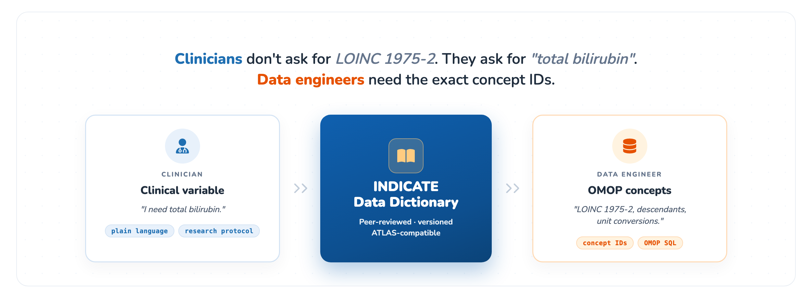
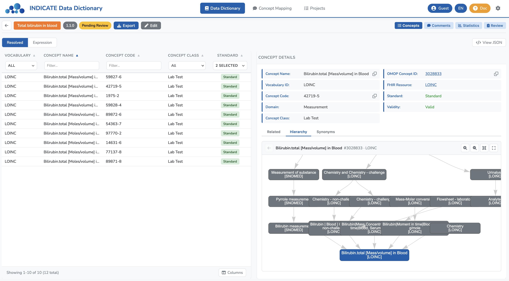

# INDICATE Data Dictionary

[](https://indicate-eu.github.io/data-dictionary/)
[](https://indicate-eu.github.io/data-dictionary/#/documentation)
[](https://indicate-europe.eu/)
[](https://joinup.ec.europa.eu/collection/eupl/eupl-text-eupl-12)



> Clinicians writing a research protocol rarely say _"I need LOINC 1975-2 and 14631-6."_ They say _"I need total bilirubin."_<br />
> Data engineers building an OMOP ETL need the exact concept IDs, descendants, and unit conversions.
>
> The **INDICATE Data Dictionary** sits between those two worlds — a shared workspace where clinical variables are defined *once*, reviewed by experts, versioned, and handed off to data teams as ready-to-use **OHDSI concept sets** with SQL, unit harmonization, and ATLAS-compatible JSON.


---

## Why this exists

The [OHDSI Phenotype Library](https://data.ohdsi.org/PhenotypeLibrary/) provides a governance framework for phenotypes — peer review, semantic versioning, status tracking, expert commentary. **No equivalent exists for concept sets**, even though they are the building blocks *underneath* phenotypes. [ATLAS](https://atlas-demo.ohdsi.org/) lets you build concept sets, but has no review workflow, no version control, and no field for expert guidance.

The INDICATE Data Dictionary fills that gap with an **extension of the OHDSI Concept Set Specification** — fully backward-compatible (JSON in, JSON out, ATLAS-compatible) — plus a static web app to browse, review, edit, and export concept sets.

## What's in the box

### For clinicians & domain experts

- **Browse by clinical category** — 300+ concept sets across demographics, conditions, vitals, labs, microbiology, ventilation, drugs, procedures, observations. Search in plain English or French.
- **Every concept set is anchored on a clinical variable** — you enter by the variable's name ("Heart rate", "Total bilirubin in blood"), read the expert commentary explaining what it actually means in practice, and *then* see the underlying list of codes, with links to source vocabularies (SNOMED, LOINC, RxNorm) for when you want to dig in.
- **Concept hierarchy at a glance** — for any concept, see where it sits in its source vocabulary as an interactive graph, so you can verify the definition captures the right level of the hierarchy.
- **Expert comments** — each concept set comes with clinical commentary written by the consortium, documenting subtleties, edge cases, and ETL gotchas (e.g. *"use this concept only if the source explicitly states the heart rate was non-invasively measured"*).
- **Review & comment without installing anything** — the site runs in your browser. Disagree with a definition? Submit a review, and the app opens a pre-filled GitHub edit page for you.
- **Multilingual** — every concept set currently carries English and French translations in its metadata; the format generalizes to any number of languages.


*Concept set detail view. The underlying OMOP concepts are listed on the left; selecting one shows its details on the right, including an interactive **concept hierarchy** graph — the concept's position within its source vocabulary — so you can check the definition sits at the right level.*


*Expert commentary written by consortium experts — definition, clinical context, and a breakdown of the included concepts grouped by specimen — giving both clinicians and ETL engineers the rationale behind the codes on the same page.*

<p align="center"></p>

*Review tab of a concept set. Each review captures the reviewer's identity, date, version, status (Approved, Needs Revision, Pending Review…) and free-text comments — giving each concept set an auditable peer-review history, similar to what the Phenotype Library provides for phenotypes.*


### For data scientists & OMOP engineers

- **ATLAS interoperability** — concept sets are stored as standard OHDSI JSON. Drop them into ATLAS, round-trip through our editor, export back. No lock-in.
- **Semantic versioning** — every concept set carries an explicit version (`v1.2.0`). The convention is to bump the version whenever a concept is added, removed, or remapped, so a study can cite the exact set it used. Version bumps are the author's responsibility, not automatic — but the app makes the current version visible everywhere it matters.
- **Review workflow** — `draft → pending review → approved → needs revision → deprecated`, with reviewer identity (ORCID), timestamps, and comments. Reviews are serialized back into the JSON and can be proposed as a GitHub PR straight from the browser.
- **Auto-generated SQL** — pick a concept set, pick your reference unit, get a ready-to-run OMOP query targeting the right CDM table for the concept set's domain (Measurement, Observation, Drug Exposure, etc.), with per-concept unit conversion baked in (`CASE WHEN unit_concept_id = ... THEN value_as_number * factor`).
- **Unit harmonization** — for laboratory concepts, the recommended unit follows a [defined methodology](https://indicate-eu.github.io/data-dictionary/#/documentation?section=sources) (NPU as primary source, LOINC `EXAMPLE_UCUM_UNITS` as fallback), with an explicit conversion table for every non-canonical unit encountered in source data.
- **Projects** — group concept sets by study / use case, export the list as CSV, or use them to scope ETL mapping priorities.
- **Dev Tools** — in-browser SQL editor (Ace + DuckDB-WASM) against loaded OHDSI vocabularies, plus an ERD visualization of the OMOP CDM.
- **Mapping recommendations** — multilingual guidance on how to map common source concepts, with examples.


*SQL export tab for a laboratory concept set. The user picks a reference unit (here `umol/L`); the app generates a ready-to-run OMOP query with a per-concept `CASE WHEN` that converts each source unit into the reference, so the `value_as_number` column comes out harmonized.*


## Quick start

There are two ways to work with the dictionary: **in the browser** (nothing to install) or **locally** (clone the repo, edit JSON, optionally with [Claude Code](https://www.anthropic.com/claude-code)). Both lead to the same place — a pull request against this repo.

### Browse the catalog

**In the browser** — no install needed. Search, filter, read expert comments and resolved concept lists right away:
→ <https://indicate-eu.github.io/data-dictionary/>

**Locally** — clone the repo and serve `docs/` as static files:
```bash
git clone https://github.com/indicate-eu/data-dictionary.git
cd data-dictionary
python3 -m http.server 8000 --directory docs   # then open http://localhost:8000
```
The catalog works offline — the bundled `docs/data.json` already contains every concept set. To search the source terminologies or build new sets, [import the OHDSI Athena vocabularies through the app's settings](https://indicate-eu.github.io/data-dictionary/#/documentation?section=dictionary-settings) (loaded into in-browser DuckDB-WASM; your data never leaves your machine).

### Edit concept sets

**In the browser** — open any concept set, click *Edit*, then *"Propose on GitHub"*. The app copies the JSON and opens the correct GitHub edit page so you can submit a pull request — no clone, no local setup. See the [documentation on editing concept sets](https://indicate-eu.github.io/data-dictionary/#/documentation?section=editing-concept-sets) for the full walkthrough.

**Locally** — edit the source JSON and open a PR yourself. This is the route for bulk changes, scripting, or working with [Claude Code](https://www.anthropic.com/claude-code) (the repo ships skills for describing, resolving, and building concept sets):
```bash
# edit concept_sets/{id}.json …
python3 resolve.py --vocab /path/to/ohdsi_vocabularies.duckdb   # if you changed an expression, re-expands descendants/mapped
python3 build.py                                               # preview locally: regenerates docs/data.json (calls snapshot.py)
```
You don't need to run `build.py` to publish — pushing to `main` triggers a GitHub Actions workflow that runs it and deploys `docs/`; it's only for previewing locally. CI does **not** run `resolve.py`, though: if you edit a concept set's `expression`, run `resolve.py` yourself and **commit** the updated `concept_sets_resolved/{id}.json`, otherwise the live site keeps showing the old resolved concepts. (No OHDSI vocabulary DuckDB? Skip `resolve.py` — the catalog still works, you just won't regenerate resolved concept lists.)

**When you bump a concept set version** (e.g. `1.0.0` → `1.1.0` in `concept_sets/{id}.json`), use a two-commit flow so projects pinned to the previous version remain reproducible:
```bash
git commit -am "Update concept set 10 to v1.1.0"   # 1) commit the bump first
python3 build.py                                   # 2) snapshot.py records the SHA in concept_sets_versions.json
git commit -am "Snapshot concept set 10 v1.1.0"    # 3) commit the index update
```
See the [documentation on projects](https://indicate-eu.github.io/data-dictionary/#/documentation?section=projects) for why versions are pinned and how to update them.

### Fork it for your own dictionary

Any group (oncology, cardiology, primary care, a single-center registry…) can use this repo as a template, edit `config.json`, run `python3 reset.py`, and bootstrap their own governed data dictionary on GitHub Pages or GitLab Pages in minutes. See [FORKING.md](FORKING.md) for the end-to-end guide.

## How it compares

<div align="center">

|                                     | ATLAS (OHDSI) | **INDICATE**        |
|:------------------------------------|:---------:|:-------------------:|
| Concept set creation & editing      | ✅ | ✅ |
| Live OMOP concept count (usage)     | ✅ | — (client-side only)|
| Peer review workflow                | — | ✅ |
| Semantic versioning                 | — | ✅ |
| Expert guidance                     | — | ✅ |
| Open source                         | ✅ | ✅ |
| Deployment                          | Institutional (WebAPI) | **Static site, Git-native** |

</div>

This is **complementary** to ATLAS: concept sets authored here can be imported back into ATLAS for cohort building — what we add is the governance layer around them.

## Architecture — zero backend

Everything is a static site on GitHub Pages:

- **Data** lives as JSON files in this repo — one file per concept set, one per project. Every change is a Git commit, so the full history of who changed what, when, and why is preserved automatically.
- **No server, no database, no login.** The web app is a single-page application that loads the JSON at startup.
- **Browse the full catalog** right away: every concept set already in the repo is visible in the app — search, filter, details, expert comments, resolved concepts — without loading anything extra.
- **Create or edit a concept set, or search the source terminologies?** Import the OHDSI Athena vocabularies (CSV or Parquet — CONCEPT, CONCEPT_ANCESTOR, CONCEPT_RELATIONSHIP, …) through the app. They're loaded *into the browser* via [DuckDB-WASM](https://duckdb.org/docs/api/wasm/overview) and cached in IndexedDB for the next visit. All SQL runs client-side — your vocabulary data never leaves your machine.
- **Deploying your own instance** is a fork + a GitHub Pages toggle. No DBA, no sysadmin, no container orchestration.

## Tech stack

The choice that makes the rest possible is **[DuckDB-WASM](https://duckdb.org/docs/api/wasm/overview)** — a full columnar SQL engine compiled to WebAssembly, running entirely inside the browser tab. It means the OMOP vocabulary — tens of millions of rows across `CONCEPT`, `CONCEPT_ANCESTOR`, `CONCEPT_RELATIONSHIP`, `CONCEPT_SYNONYM` — can be loaded from Athena CSVs or Parquet, persisted to IndexedDB, and queried with real SQL, all client-side. In practice we routinely import **RxNorm, LOINC, SNOMED CT, and ICD-10 together**, with their full relationship and ancestor tables, and queries stay responsive. No server, no database to provision, no data leaving the user's machine.

From there, the rest is small pieces of plain web:

- **GitHub Pages** (or GitLab Pages) for hosting — static files, free, auto-deploy on `git push`.
- **Vanilla JavaScript SPA** — no framework, no build step. Each page is a small IIFE module; routes are hash-based. Keeps the app easy to fork and hack on.
- **[Ace Editor](https://ace.c9.io/)** for the in-browser SQL console, **[marked](https://marked.js.org/)** for rendering the Markdown expert comments, **[vis-network](https://visjs.github.io/vis-network/)** for the ERD visualization of the OMOP CDM.
- **Python scripts** (`resolve.py`, `build.py`) handle the build — resolving concept set expressions against a DuckDB vocabulary, then packing everything into `data.json` for the static site. `build.py` runs automatically on every push to `main` via GitHub Actions, so the live site is always in sync with the source JSON.

The net effect: a full-featured concept set governance app — with a client-side OMOP vocabulary — running on **$0/month infrastructure**, deployable by anyone with a GitHub account.

## The INDICATE project

The [INDICATE consortium](https://indicate-europe.eu/), funded by the European Union's Digital Europe Programme (grant 101167778), is building federated infrastructure for standardized ICU data across **15 data providers in 12 European countries**, with **6 clinical use cases**. The Data Dictionary is the common variable layer underneath: a consensus-built set of **300+ concept sets** across 9 clinical categories, built on OMOP CDM with SNOMED, LOINC, RxNorm, and UCUM.

## Repository layout

```
concept_sets/                # Concept set definitions (OHDSI format + INDICATE metadata), one JSON per set
concept_sets_resolved/       # Resolved concept sets (descendants + mapped, generated by resolve.py)
projects/                    # Clinical project definitions with linked concept sets (each pinned to a specific version)
units/                       # Recommended units + unit conversion table
mapping_recommendations/     # Multilingual ETL mapping guidance
docs/                        # GitHub Pages SPA (browse/edit/review in the browser)
concept_sets_versions.json   # Index { id: { version: commit_sha } } — points to historical snapshots in Git
build.py                     # Aggregates JSON → docs/data.json + docs/data_inline.js (also calls snapshot.py)
resolve.py                   # Expands expressions via OMOP vocab (DuckDB)
snapshot.py                  # Records commit SHAs in concept_sets_versions.json on version bumps
reset.py                     # Wipes content for a fresh fork (see FORKING.md)
update_from_upstream.py      # Pulls code updates from this repo into a fork
config.json                  # Per-fork branding, GitHub repo, organization
.github/workflows/           # GitHub Actions: rebuilds docs/ and deploys to GitHub Pages on every push to main
.gitlab-ci.yml               # GitLab Pages deployment (no-op on GitHub)
CLAUDE.md                    # Project conventions, schemas, build pipeline
FORKING.md                   # Guide for teams reusing this app for their own dictionary
```

See [CLAUDE.md](CLAUDE.md) for full schemas, build pipeline, and conventions.

## Documentation

→ [Full documentation](https://indicate-eu.github.io/data-dictionary/#/documentation) (bilingual EN/FR)

Covers: concept set structure, browsing & filtering, the editor, review workflow, SQL export, projects, unit conversions, dev tools, and local data.

## License

[EUPL-1.2](LICENSE) — European Union Public Licence. Free to use, modify, and redistribute, including in commercial settings, under the same license.

## Acknowledgments

Funded by the **European Union's Digital Europe Programme** under grant agreement **101167778**.
Developed with clinicians, data scientists, and interoperability experts from 15 institutions across 12 countries.
