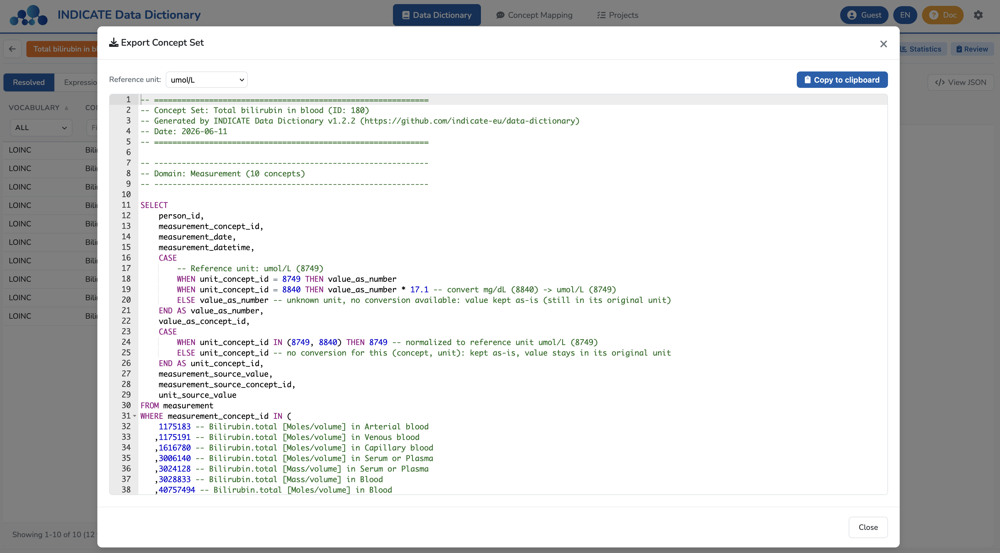
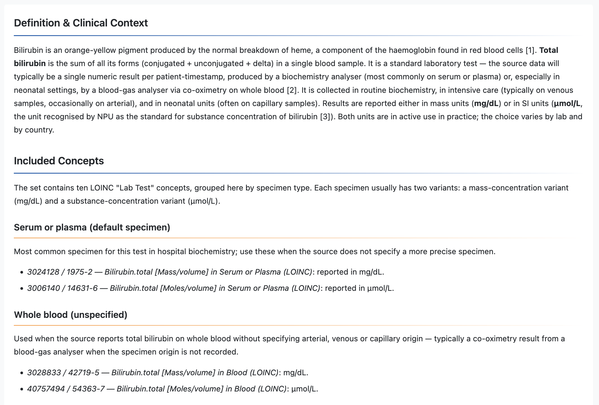

# INDICATE Data Dictionary

[](https://indicate-eu.github.io/data-dictionary/)
[](https://indicate-eu.github.io/data-dictionary/#/documentation)
[](https://indicate-europe.eu/)
[](https://joinup.ec.europa.eu/collection/eupl/eupl-text-eupl-12)


> A clinician writing a research protocol rarely says _"I need LOINC 1975-2 and 14631-6."_ They say _"I need total bilirubin."_<br />
> A data engineer building an OMOP ETL needs the exact concept IDs, descendants, and unit conversions.
>
> The **INDICATE Data Dictionary** sits between those two worlds — a shared workbench where clinical variables are defined *once*, reviewed by experts, versioned, and handed off to data teams as ready-to-use **OHDSI concept sets** with SQL, unit harmonization, and ATLAS-compatible JSON.

---

## Why this exists

The [OHDSI Phenotype Library](https://data.ohdsi.org/PhenotypeLibrary/) provides a governance framework for phenotypes — peer review, semantic versioning, status tracking, expert commentary. **No equivalent exists for concept sets**, even though they are the building blocks *underneath* phenotypes. [ATLAS](https://atlas-demo.ohdsi.org/) lets you build concept sets, but has no review workflow, no version control, and no field for expert guidance.

The INDICATE Data Dictionary fills that gap with an **extension of the OHDSI Concept Set Specification** — fully backward-compatible (JSON in, JSON out, ATLAS-compatible) — plus a static web app to browse, review, edit, and export concept sets.

<!-- TODO: hero screenshot — concept set browser in action (suggested: docs/screenshots/browser.png) -->
<!--  -->

## What's in the box

### For data scientists & OMOP engineers

- **ATLAS interoperability** — concept sets are stored as standard OHDSI JSON. Drop them into ATLAS, round-trip through our editor, export back. No lock-in.
- **Semantic versioning** — every concept set carries an explicit version (`v1.2.0`). The convention is to bump the version whenever a concept is added, removed, or remapped, so a study can cite the exact set it used. Version bumps are the author's responsibility, not automatic — but the app makes the current version visible everywhere it matters.
- **Review workflow** — `draft → pending review → approved → needs revision → deprecated`, with reviewer identity (ORCID), timestamps, and comments. Reviews are serialized back into the JSON and can be proposed as a GitHub PR straight from the browser.
- **Auto-generated SQL** — pick a concept set, pick your reference unit, get a ready-to-run OMOP query targeting the right CDM table for the concept set's domain (Measurement, Observation, Drug Exposure, etc.), with per-concept unit conversion baked in (`CASE WHEN unit_concept_id = ... THEN value_as_number * factor`).
- **Unit harmonization** — for laboratory concepts, the recommended unit follows [LOINC's `EXAMPLE_UCUM_UNITS`](https://loinc.org/downloads/) as single source of truth, with an explicit conversion table for every non-canonical unit encountered in source data. (For non-lab concepts — vitals, anthropometrics, scales, drug doses — the methodology for choosing a recommended unit is not yet defined; see [CLAUDE.md](CLAUDE.md#unit-conventions).)
- **Projects** — group concept sets by study / use case, export the list as CSV, or use them to scope ETL mapping priorities.
- **Dev Tools** — in-browser SQL editor (Ace + DuckDB-WASM) against loaded OHDSI vocabularies, plus an ERD visualization of the OMOP CDM.
- **Mapping recommendations** — multilingual guidance on how to map common source concepts, with examples.


*SQL export tab for a laboratory concept set. The user picks a reference unit (here `umol/L`); the app generates a ready-to-run OMOP query with a per-concept `CASE WHEN` that converts each source unit into the reference, so the `value_as_number` column comes out harmonized.*


### For clinicians & domain experts

- **Browse by clinical category** — 300+ concept sets across demographics, conditions, vitals, labs, microbiology, ventilation, drugs, procedures, observations. Search in plain English or French.
- **Every concept set is anchored on a clinical variable** — you enter by the variable's name ("Heart rate", "Total bilirubin in blood"), read the expert commentary explaining what it actually means in practice, and *then* see the underlying list of codes, with links to source vocabularies (SNOMED, LOINC, RxNorm) for when you want to dig in.
- **Expert comments** — each concept set comes with clinical commentary written by the consortium, documenting subtleties, edge cases, and ETL gotchas (e.g. *"use this concept only if the source explicitly states the heart rate was non-invasively measured"*).
- **Review & comment without installing anything** — the site runs in your browser. Disagree with a definition? Submit a review, and the app opens a pre-filled GitHub edit page for you.
- **Multilingual** — every concept set currently carries English and French translations in its metadata; the format generalizes to any number of languages.


*Concept set detail view. The clinical commentary written by consortium experts — subtleties of measurement, edge cases, ETL guidance — sits next to the list of underlying OMOP concepts, so both clinicians and ETL engineers find what they need on the same page.*

<p align="center"></p>

*Review tab of a concept set. Each review captures the reviewer's identity, date, version, status (Approved, Needs Revision, Pending Review…) and free-text comments — giving each concept set an auditable peer-review history, similar to what the Phenotype Library provides for phenotypes.*


## How it compares

<div align="center">

|                                     | ATLAS (OHDSI) | **INDICATE**        |
|:------------------------------------|:---------:|:-------------------:|
| Concept set creation & editing      | ✅ | ✅ |
| Live OMOP concept count (usage)     | ✅ | — (client-side only)|
| Peer review workflow                | — | ✅ |
| Semantic versioning                 | — | ✅ |
| Expert guidance                     | — | ✅ |
| Open source                         | ✅ | ✅ |
| Deployment                          | Institutional (WebAPI) | **Static site, Git-native** |

</div>

This is **complementary** to ATLAS: concept sets authored here can be imported back into ATLAS for cohort building — what we add is the governance layer around them.

## Architecture — zero backend

Everything is a static site on GitHub Pages:

- **Data** lives as JSON files in this repo — one file per concept set, one per project. Every change is a Git commit, so the full history of who changed what, when, and why is preserved automatically.
- **No server, no database, no login.** The web app is a single-page application that loads the JSON at startup.
- **Browse the full catalog** right away: every concept set already in the repo is visible in the app — search, filter, details, expert comments, resolved concepts — without loading anything extra.
- **Create or edit a concept set, or search the source terminologies?** Import the OHDSI Athena vocabularies (CSV or Parquet — CONCEPT, CONCEPT_ANCESTOR, CONCEPT_RELATIONSHIP, …) through the app. They're loaded *into the browser* via [DuckDB-WASM](https://duckdb.org/docs/api/wasm/overview) and cached in IndexedDB for the next visit. All SQL runs client-side — your vocabulary data never leaves your machine.
- **Deploying your own instance** is a fork + a GitHub Pages toggle. No DBA, no sysadmin, no container orchestration.

## Tech stack

The choice that makes the rest possible is **[DuckDB-WASM](https://duckdb.org/docs/api/wasm/overview)** — a full columnar SQL engine compiled to WebAssembly, running entirely inside the browser tab. It means the OMOP vocabulary — tens of millions of rows across `CONCEPT`, `CONCEPT_ANCESTOR`, `CONCEPT_RELATIONSHIP`, `CONCEPT_SYNONYM` — can be loaded from Athena CSVs or Parquet, persisted to IndexedDB, and queried with real SQL, all client-side. In practice we routinely import **RxNorm, LOINC, SNOMED CT, and ICD-10 together**, with their full relationship and ancestor tables, and queries stay responsive. No server, no database to provision, no data leaving the user's machine.

From there, the rest is small pieces of plain web:

- **GitHub Pages** (or GitLab Pages) for hosting — static files, free, auto-deploy on `git push`.
- **Vanilla JavaScript SPA** — no framework, no build step. Each page is a small IIFE module; routes are hash-based. Keeps the app easy to fork and hack on.
- **[Ace Editor](https://ace.c9.io/)** for the in-browser SQL console, **[marked](https://marked.js.org/)** for rendering the Markdown expert comments, **[vis-network](https://visjs.github.io/vis-network/)** for the ERD visualization of the OMOP CDM.
- **Python scripts** (`resolve.py`, `build.py`) handle the offline build — resolving concept set expressions against a DuckDB vocabulary, then packing everything into `data.json` for the static site.

The net effect: a full-featured concept set governance app — with a client-side OMOP vocabulary — running on **$0/month infrastructure**, deployable by anyone with a GitHub account.

## Roadmap

Near-term, in roughly this order:

1. **Refine the INDICATE concept sets and run the review process** — a first stable version of the 300+ concept sets is released and is already being used by data providers to build their OMOP ETLs. As those first ETLs run and the dictionary gets exercised against real data, providers surface suggestions (missing concepts, ambiguous mappings, unit edge cases) that feed back into the definitions.
2. **`source_to_concept_map.csv` upload for data providers** — let a site upload its OMOP `source_to_concept_map` and instantly see, per clinical project, which variables it can actually populate (eligibility check for multi-site studies). Runs entirely in the browser via DuckDB-WASM.
3. **Fork-as-a-template** — *now available.* Any group (oncology, cardiology, primary care, a single-center registry…) can use this repo as a template, edit `config.json`, run `reset.py`, and bootstrap their own governed data dictionary on GitHub Pages or GitLab Pages in minutes. See [FORKING.md](FORKING.md) for the step-by-step guide.
4. **OHDSI community alignment** — bring this into the OHDSI ecosystem. The goal isn't to maintain a parallel tool forever, but to bring library-grade governance to concept sets *inside* OHDSI. Two possible paths, both worth discussing:
   - **Extend ATLAS** — add the review workflow, semantic versioning, and `longDescription` field to ATLAS directly, using this app as a reference implementation.
   - **A dedicated OHDSI Concept Set Library** — a counterpart to the Phenotype Library, cross-network, community-governed.

We presented this at the [OHDSI Europe Symposium 2026](https://www.ohdsi-europe.org/) as a starting point. **If you'd like to help shape any of the above, open an issue or a discussion — we're listening.**

## The INDICATE project

The [INDICATE consortium](https://indicate-europe.eu/), funded by the European Union's Digital Europe Programme (grant 101167778), is building federated infrastructure for standardized ICU data across **15 data providers in 12 European countries**, with **6 clinical use cases**. The Data Dictionary is the common variable layer underneath: a consensus-built set of **300+ concept sets** across 9 clinical categories, built on OMOP CDM with SNOMED, LOINC, RxNorm, and UCUM.

## Repository layout

```
concept_sets/              # Concept set definitions (OHDSI format + INDICATE metadata), one JSON per set
concept_sets_resolved/     # Resolved concept sets (descendants + mapped, generated by resolve.py)
projects/                  # Clinical project definitions with linked concept sets
units/                     # Recommended units + unit conversion table
mapping_recommendations/   # Multilingual ETL mapping guidance
docs/                      # GitHub Pages SPA (browse/edit/review in the browser)
build.py                   # Aggregates JSON → docs/data.json + docs/data_inline.js
resolve.py                 # Expands expressions via OMOP vocab (DuckDB)
reset.py                   # Wipes content for a fresh fork (see FORKING.md)
update_from_upstream.py    # Pulls code updates from this repo into a fork
config.json                # Per-fork branding, GitHub repo, organization
.gitlab-ci.yml             # GitLab Pages deployment (no-op on GitHub)
CLAUDE.md                  # Project conventions, schemas, build pipeline
FORKING.md                 # Guide for teams reusing this app for their own dictionary
```

See [CLAUDE.md](CLAUDE.md) for full schemas, build pipeline, and conventions.

## Quick start

**Browse the catalog** — no install needed:
→ <https://indicate-eu.github.io/data-dictionary/>

**Rebuild locally after editing JSON:**
```bash
python3 resolve.py --db /path/to/ohdsi_vocabularies.duckdb   # optional, expands descendants/mapped
python3 build.py                                             # regenerates docs/data.json
```
(Skip `resolve.py` if you don't have an OHDSI vocabulary DuckDB — the site works without it, you just won't see resolved concept lists.)

**Propose a change** — edit any `concept_sets/{id}.json`, open a PR. Or use the in-browser editor and click *"Propose on GitHub"* — it copies the JSON and opens the correct edit page for you.

**Fork it for your own dictionary** — see [FORKING.md](FORKING.md) for the end-to-end guide (use this template → edit `config.json` → replace logo → `python3 reset.py` → publish on GitHub Pages or GitLab Pages).

## Documentation

→ [Full documentation](https://indicate-eu.github.io/data-dictionary/#/documentation) (bilingual EN/FR)

Covers: concept set structure, browsing & filtering, the editor, review workflow, SQL export, projects, unit conversions, dev tools, and local data.

## License

[EUPL-1.2](LICENSE) — European Union Public Licence. Free to use, modify, and redistribute, including in commercial settings, under the same license.

## Acknowledgments

Funded by the **European Union's Digital Europe Programme** under grant agreement **101167778**.
Developed with clinicians, data scientists, and interoperability experts from 15 institutions across 12 countries.
